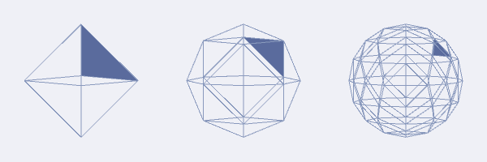

Kaggle Santa's Stolen Sleigh Solution
==========================

This repository contains my solution to the Kaggle
[Santa's Stolen Sleigh](https://www.kaggle.com/c/santas-stolen-sleigh)
competition. The challenge was to find an optimal way to delivering
presents distributed across the globe given a per-trip weight
limit. Solutions were scored using a cost function based on distance
and weight. The challenge's designer provides more detail
in [this post](http://blog.kaggle.com/2016/01/19/creating-santas-stolen-sleigh-kaggles-annual-optimization-competition/).

This was essentially a
[capacitated vehicle routing problem](https://en.wikipedia.org/wiki/Vehicle_routing_problem).
I approached it by clustering presents based on geographic
distance. To avoid an O(N^2) computation, I needed a way to
efficiently determine a present's closest neighbors. I ended up using
a form of spherical quad-tree, or [Quaternary triangular mesh](https://en.wikipedia.org/wiki/Grid_(spatial_index)#Types_of_grids),
based on a coordinate transformation method described in
[this paper](http://www.sciencedirect.com/science/article/pii/104996529290032S). 

To make sure I got the math right, I wrote a small prototype in [Processing](https://processing.org)
The following animation is an example of the prototype. The source code can be found under the `utils` directory.

Given latitude and longitude locations, the SQT maps each of them to
an [octahedron](https://en.wikipedia.org/wiki/Octahedron) face. The
octahedron is then tessellated and the points mapped to the appropriate
triangles. When the tessellation is done, locations close to each other
get mapped to the same triangle. This substantially reduces the number
of locations to consider when clustering. My SQT implementation is
extremely simple - all points must be added before the tessellation is
done and it doesn't support hierarchical querying.  But the
implementation can be extended to be a general purpose SQT.

In prior competitions, I ran into run-time issues with solutions implemented in [R](https://www.r-project.org),
[Python](https://www.python.org), and [Julia](http://julialang.org). This time I decided to try [Go](https://golang.org).
I was very happy with this choice. Execution time was very short and I liked Go's minimalist syntax.

